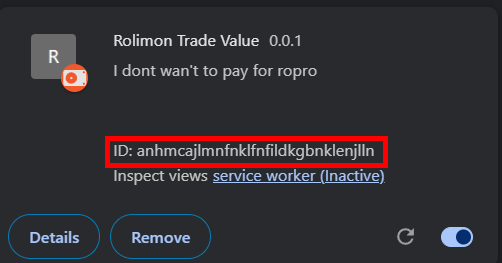
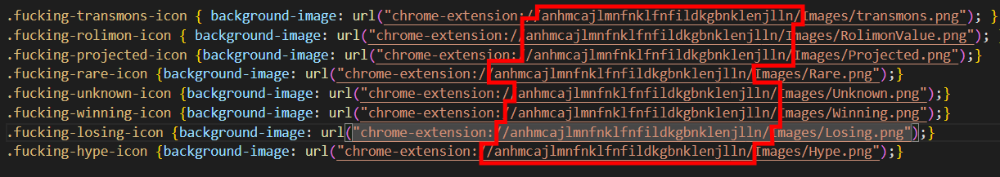

The JS is probably really bad but it works and that's what matters.

#Step 1: Follow this other tutorial
Follow this tutorial on loading unpacked extensions (It shouldn't take too long it's basically just go to chrome://extensions and click the load unpacked extensions button [With developer mode enabled]): https://knowledge.workspace.google.com/kb/load-unpacked-extensions-000005962

#Step 2: Get extension ID

#Step 3: In CSS/Styles.css put in your extension ID.

#Step 4: Reload extension
If there is an error it's either because my JS is shit or the extension is injecting the new script into a tab with the old JS which causes an error (Also because my JS is shit)
